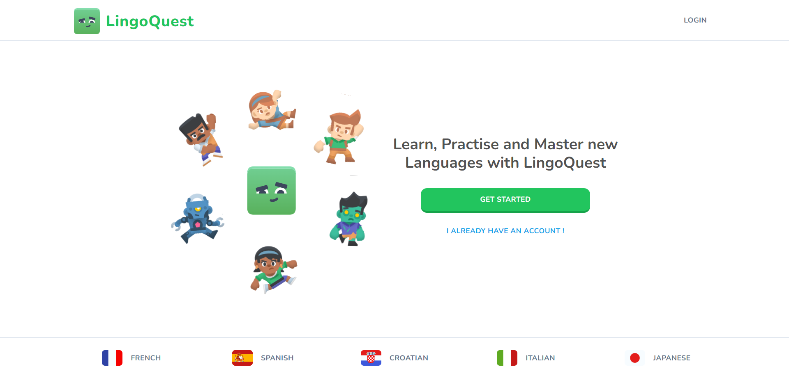
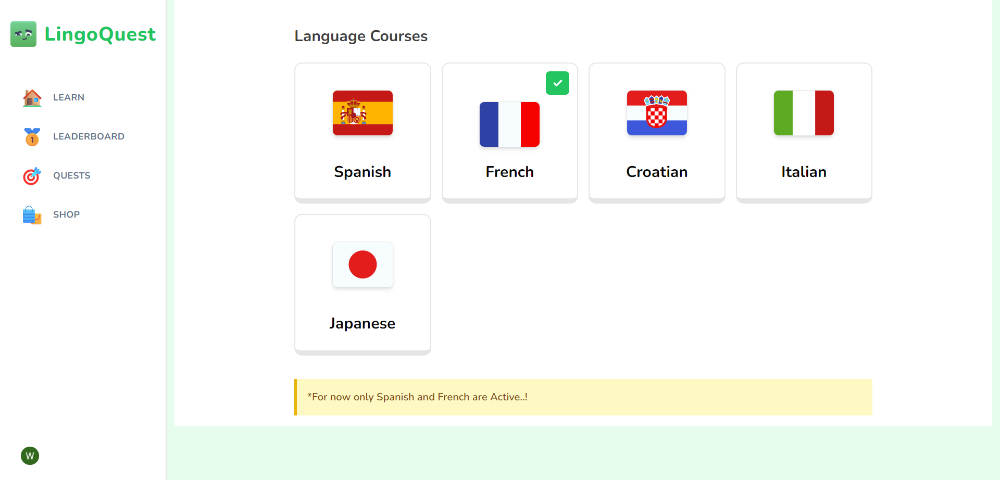

# LingoQuest

**LingoQuest** is an engaging language learning platform inspired by Duolingo. It provides users with a seamless learning experience through interactive lessons, captivating characters, and a range of gamified features. With LingoQuest, you can embark on a journey to master multiple languages while enjoying a beautifully designed interface.

## 🌟 General Information

1. **General Info**: LingoQuest is designed to make language learning fun and interactive. The platform offers a variety of lessons and challenges to help users learn new languages efficiently.
2. **Problem Solved**: It addresses the need for a more engaging and interactive language learning tool, combining visual and auditory stimuli with gamified elements to enhance learning.
3. **Purpose**: To provide a comprehensive and enjoyable language learning experience that motivates users through interactive lessons, characters, and gamified features.

## 🛠️ Technologies Used

- **Next.js 14**: For server-side rendering and static site generation.
- **Elevenlabs AI**: For realistic AI-powered voiceovers.
- **Shadcn UI**: For beautifully designed UI components.
- **KenneyNL**: For engaging and dynamic characters.
- **Clerk**: For secure authentication.
- **Stripe**: For payment processing and subscription management.
- **Drizzle ORM**: For ORM and database operations.
- **NeonDB**: For PostgreSQL database management.
- **Vercel**: For deployment and hosting.

## 🎨 Features

- 🌐 Modern Tech Stack
- 🗣 AI-Powered Voices
- 🎨 Stunning Design
- 🎭 Engaging Characters
- 🔐 Secure Authentication
- 🔊 Sound Effects
- ❤️ Hearts System
- 🌟 Points & XP
- 💔 No Hearts Left Popup
- 🚪 Exit Confirmation
- 🔄 Practice Old Lessons
- 🏆 Leaderboards
- 🗺 Quests & Milestones
- 🛍 Shop System
- 💳 Pro Tier for Unlimited Hearts
- 🏠 Landing Page
- 📊 Admin Dashboard
- 🌧 Drizzle ORM
- 💾 PostgreSQL
- 🚀 Deployment
- 📱 Mobile Responsive

## Live Link
# 


## 📸 Screenshots




## 📋 Setup

### Requirements/Dependencies

- [Node.js](https://nodejs.org/) (v14 or later)
- [npm](https://www.npmjs.com/) (comes with Node.js)
- PostgreSQL database

### Installation Steps

1. **Clone the Repository**

   ```bash
   git clone https://github.com/yourusername/lingoquest.git
   cd lingoquest


2. Install Dependencies

    ```bash
    npm install

3. Configuration
  Create a .env file in the root directory and add your configuration settings:
  
    ```bash
    DATABASE_URL=your_database_url
    CLERK_API_KEY=your_clerk_api_key
    STRIPE_SECRET_KEY=your_stripe_secret_key

4. Run Migrations
   Set up your database schema:

     ```bash
      npx drizzle-cli db:migrate
    
6. Start the Development Server
    ```bash
    npm run dev

Visit http://localhost:3000 to access the application.

## 🏷️ Usage

**LingoQuest** provides a variety of interactive lessons and challenges. Users can:

- **Choose a Language Course**: Select from multiple language courses.
- **Complete Lessons**: Engage in guided lessons with audio and visual effects.
- **Track Progress**: Monitor learning progress through hearts, points, and XP.
- **Participate in Quests**: Achieve milestones and unlock new challenges.
- **Use the Shop**: Exchange points for hearts and other rewards.
- **Upgrade to Pro**: Access unlimited hearts with a premium subscription.

## 🚧 Project Status

**Status**: *In Progress*

**Reason**: *We are continually adding new features and refining the user experience.*

## 🛠️ Room For Improvement
### Improvements
- **Improvement 1**: Enhance the character animations for a more immersive experience.
- **Improvement 2**: Expand the number of available languages and lessons.
- **Improvement 3**: Optimize performance for faster load times.
### Features to be Added    
- **Feature to be added 1**: Multi-language support for the user interface.
- **Feature to be added 2**: Advanced analytics for tracking user progress.
- **Feature to be added 3**: Integration with additional language learning resources.
## 🙌 Acknowledgements
**This project was inspired by: Duolingo and other interactive language learning platforms.**

## 📬 Contact

- [LinkedIn](www.linkedin.com/in/csreerag)
- [GitHub](https://github.com/SreeRag1907)
